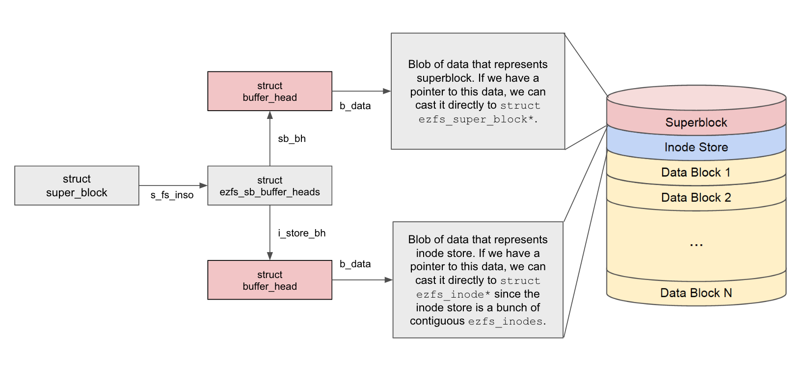

EZFS
======

Part 0: Formatting and mounting disks
-------------------------------------

A loop device is a pseudo-device that makes a file accessible as a block device.
Files of this kind are often used for CD ISO images. Mounting a file containing
a file system via such a loop mount makes the files within that file system
accessible.

### Exploring ext2

1.  Create a loop device, build & mount an ext2 filesystem, and try creating
    directories and files. Below is a sample session you can follow that starts
    from my home directory. It goes without saying that you need to understand 
    what's going on at each step. Look at the man pages. Google stuff.

        $ sudo su
        # dd if=/dev/zero of=./ext2.img bs=1024 count=100
        100+0 records in
        100+0 records out
        102400 bytes (102 kB, 100 KiB) copied, 0.000600037 s, 171 MB/s
        # modprobe loop
        # losetup --find --show ext2.img
        /dev/loop0
        # mkfs -t ext2 /dev/loop0
        mke2fs 1.44.5 (15-Dec-2018)
        Creating filesystem with 100 1k blocks and 16 inodes

        Allocating group tables: done                            
        Writing inode tables: done                            
        Writing superblocks and filesystem accounting information: done

        # mkdir mnt
        # mount /dev/loop0 ./mnt
        # df -hT
        Filesystem     Type      Size  Used Avail Use% Mounted on
        ...
        /dev/loop0     ext2       93K   14K   74K  16% /root/mnt
        # cd mnt
        # ls -al
        total 17
        drwxr-xr-x  3 root root  1024 Apr 21 02:22 .
        drwxr-xr-x 37 hans hans  4096 Apr 21 02:22 ..
        drwx------  2 root root 12288 Apr 21 02:22 lost+found
        # mkdir sub2
        # ls -al
        total 18
        drwxr-xr-x  4 root root  1024 Apr 21 02:23 .
        drwxr-xr-x 37 hans hans  4096 Apr 21 02:22 ..
        drwx------  2 root root 12288 Apr 21 02:22 lost+found
        drwxr-xr-x  2 root root  1024 Apr 21 02:23 sub2
        # cd sub2
        # ls -al
        total 2
        drwxr-xr-x 2 root root 1024 Apr 21 02:23 .
        drwxr-xr-x 4 root root 1024 Apr 21 02:23 ..
        # mkdir sub2.1
        # ls -al
        total 3
        drwxr-xr-x 3 root root 1024 Apr 21 02:24 .
        drwxr-xr-x 4 root root 1024 Apr 21 02:23 ..
        drwxr-xr-x 2 root root 1024 Apr 21 02:24 sub2.1
        # touch file2.1
        # ls -al
        total 3
        drwxr-xr-x 3 root root 1024 Apr 21 02:24 .
        drwxr-xr-x 4 root root 1024 Apr 21 02:23 ..
        -rw-r--r-- 1 root root    0 Apr 21 02:24 file2.1
        drwxr-xr-x 2 root root 1024 Apr 21 02:24 sub2.1
        # cd ../../
        # umount mnt/
        # losetup --find
        /dev/loop1
        # losetup --detach /dev/loop0
        # losetup --find
        /dev/loop0
        # ls -al mnt/
        total 8
        drwxr-xr-x  2 root root 4096 Apr 21 02:22 .
        drwxr-xr-x 37 hans hans 4096 Apr 21 02:22 ..

2.  In the sample session shown above, files and directories are created.
    Make sure you see the number of links each file or directory has, and
    make sure you understand why.

    Also try creating some hard links and symlinks.  Make sure you
    understand how they affect the link counts.


### Preparing your module build environment

Familiarize yourself with writing and using [Linux kernel modules][modules-tutorial].

In this assignment, we provide a compiled reference implementation of EZFS
for you to test your implementation against.

We provide reference implementations (`ref/ez-x86.ko` and `ref/ez-arm.ko`),
compiled against the stock Debian 11 kernel (`5.10.0-8-amd64` and `5.10.0-9-arm64`,
respectively). You should boot into this kernel for the rest of this assignment.

If your kernel name is slightly differerent (e.g. `5.10.0-9-amd64`), you may get a
versioning error when you try to insert the reference implementation. In that case,
you can try forcibly inserting the module with `insmod -f`.

[modules-tutorial]: https://cs4118.github.io/dev-guides/linux-modules.html

### Exploring EZFS

In this part, we will mount a loop device and format it as EZFS. Then, we'll
use the reference implementation to interact with our newly formatted disk.


1.  Create a disk image and assign it to a loop device:

        $ dd bs=4096 count=200 if=/dev/zero of=~/ez_disk.img
        # losetup --find --show ~/ez_disk.img

    -   This will create the file `ez_disk.img` and bind it to an available
        loop device, probably `/dev/loop0`. Now, `/dev/loop0` can be used as if
        it were a physical disk, and the data backing it will be stored in
        `ez_disk.img`.

2.  Format the disk as EZFS.

        # ./format_disk_as_ezfs /dev/loop<N>
        
    -   The skeleton code contains a formatting program called
        `format_disk_as_ezfs.c`. Inspect it and then run it as
        shown above.
    
3.  Mount the disk at `/mnt/ez` using the reference implementation:

        # mkdir /mnt/ez
        # insmod ezfs.ko
        # mount -t ezfs /dev/loop<N> /mnt/ez

4.  Explore the newly created filesystem. Edit `hello.txt`, create some new
    files, etc.


Part 1: Creating additional files upon formatting
-------------------------------------------------

The formatting utility creates the new filesystem's root directory and places
`hello.txt` in that directory. In this part, we will create another directory
and files.

### EZFS Specification

[View slides][ezfs-spec]

[ezfs-spec]: ezfs-spec.pdf

### Tasks

1.  Read the provided formatting utility, `format_disk_as_ezfs.c`. Make sure
    you understand the on-disk format and what each line contributes toward
    creating the filesystem. Test your understanding by thinking about the
    following questions:

    -   The program writes two inodes for the root directory and `hello.txt`,
        but does not zero out the rest of the inode block. Can you convince
        yourself that this is OK?

    -   However, for filling out the root directory block, the program ensures
        that the unused portion of the block is zeroed out. Can you see why
        this is necessary?

2.  Extend the program to create a subdirectory called `subdir`. The directory
    should contain `names.txt` that lists the names of your team members, 
    `big_img.jpeg` and `big_txt.txt` in your repo subdir `big_files`.

    -   To make things easier, consider starting with an empty `subdir`
        directory. Once you have that working, create `names.txt`, then 
        `big_img.jpeg` and `big_txt.txt`.

    -   `names.txt` will take data_block_number \[5\], while `big_img.jpeg` 
        will take \[6-13\], and `big_txt.txt` \[14-15\].

    -   Be sure to set the directories' link counts correctly.

3.  Create and format a new disk using your modified program. Use the reference
    implementation, `ezfs.ko`, to verify that the new file and directory were
    created correctly. You can use the `stat` command to see the size, inode
    number, and other properties.


Part 2: The filesystem awakens
------------------------------

The rest of this assignment is structured to guide you while implementing your
filesystem driver. Each part represents a milestone toward a working driver,
forcing you to develop incrementally.

In this part, we will begin by writing the code that mounts disks. Later, we'll
add the ability to read files, modify existing files, create new files,
delete files, and even create and remove directories.

You need to take care of concurrency in your filesystem driver. 
That is, you may assume that each EZFS disk will have multiple threads performing
operations at any given time.

You are welcome to search the web for info. The `Documentation/` directory in
the Linux source tree contains a wealth of information as well. Here are some
resources that might be useful:

Recommended
1.  LKD chapter 13

2.  LKD chapter 14: pages 289 - 294

3.  LKD chapter 16: pages 326 - 331

4.  [BFS filesystem][bfs-spec]: [Source Code][bfs-code]

5.  [Page cache overview slides][page-cache-overview]


Optional
1.  [Linux Kernel Internals chapter 3 (Virtual Filesystem)][lki-vfs]

2.  [`Documentation/filesystems/vfs.rst`][vfs.rst]

3.  [Linux VFS tutorial at lwn.net][lwn-vfs]

    -   Note that the tutorial was written for an older version of the Linux
        kernel, so its code doesn't build on our version. Nevertheless, the
        article provides a good high-level overview of how to interact with VFS.


[bfs-spec]: http://martin.hinner.info/fs/bfs/bfs-structure.html
[bfs-code]: https://elixir.bootlin.com/linux/v5.10.138/source/fs/bfs
[page-cache-overview]: page-cache-overview.pdf
[lki-vfs]: http://www.tldp.org/LDP/lki/lki-3.html
[vfs.rst]: https://elixir.bootlin.com/linux/v5.10.138/source/Documentation/filesystems/vfs.rst
[lwn-vfs]: https://lwn.net/Articles/57369/

### Tasks

1.  Read the skeleton code starting from its entry point, `ezfs_init()`.
    This module is written so that it can be loaded simultaneously with the
    reference implementation. How is this accomplished?

2.  Unmount your EZFS drive and try to mount it with the skeleton code
    instead. The following error message indicates that you are no longer
    mounting with the reference implementation:

        mount: /mnt/ez: permission denied.

    This error is returned from `ezfs_fill_super()` via `ezfs_mount()`.

3.  Implement `ezfs_fill_super()` so that you can mount disks. Note that
    we're only interested in making the `mount` and `umount` commands work
    cleanly in this part. We won't be reading any files or directories at this
    time.

    -   Use `sb_set_blocksize()` to ensure that the block layer reads blocks of
        the correct size.

    -   Read the EZFS superblock and inodes. Assign them to an instance of
        `struct ezfs_sb_buffer_heads`. Store this struct in the `s_fs_info`
        member of the VFS superblock. This way, we can always find the EZFS
        superblock and inodes by following the trail of pointers from the VFS
        superblock.

        The following diagram shows the relationship between these structs after
        this step.

        

    -   You will have to fill out some additional members of the VFS superblock
        structure, such as the magic number and pointer to the ops struct.

    -   Use `iget_locked()` to create a new VFS inode for the root directory.
        Read the kernel source to learn what this function does for you and get
        some hints on how you're supposed to use it. The only metadata you need
        to set is the mode. Make the root directory `drwxrwxrwx` for now.

    -   After creating an inode for the root directory, you need to create a
        dentry associated with it. Make the VFS superblock point to the dentry.

    -   Make sure to handle errors by returning an appropriate error code. For
        example, what if someone asks you to mount a filesystem that isn't
        EZFS?


Part 3: Listing the contents of the root directory
--------------------------------------------------

### Tasks

1.  In the previous part, we created a VFS inode without associating it with the
    corresponding EZFS inode from disk. Update your code to associate the
    root VFS inode with the root EZFS inode.

    -   Use the `i_private` member of the VFS inode to store a pointer to the
        EZFS inode. All of the EZFS inodes live in the inode store that
        we read from disk in the previous section.

    -   Note that you must set the `i_sb` and `i_op` members so that VFS can
        identify which filesystem the inode belongs to.

    -   Consult the diagram in the EZFS Specification section.

2.  Add support for listing the root directory.

    -   You should be able to run `ls` and `ls -a`. Here's sample session:

            # ls /mnt/ez
            hello.txt  subdir
            # ls -a /mnt/ez
            .  ..  hello.txt  subdir
            # ls /mnt/ez/subdir
            ls: cannot access '/mnt/ez/subdir': No such file or directory

        Note that we do not support listing the contents of a subdirectory yet.

    -   The VFS framework will call the `iterate` member of the
        `struct file_operations`. Inside your `iterate` implementation, use
        `dir_emit()` to provide VFS with the contents of the requested
        directory. VFS will continue to call `iterate` until your implementation
        returns without calling `dir_emit()`.

    -   For now, you can pass in `DT_UNKNOWN` as the `type` argument for
        `dir_emit()`. We will revisit this in part6.

    -   You can use the `ctx->pos` variable as a cursor to the directory entry
        that you are about to emit. (Note that the `dir_emit_dots()` function
        modifies `ctx->pos`.)

    -   The following is an excerpt from the output of
        `strace ls /usr/bin > /dev/null`:

            [...]
            openat(AT_FDCWD, "/usr/bin", O_RDONLY|O_NONBLOCK|O_CLOEXEC|O_DIRECTORY) = 3
            [...]
            getdents64(3, /* 1003 entries */, 32768) = 32744
            [...]
            getdents64(3, /* 270 entries */, 32768) = 8888
            [...]
            getdents64(3, /* 0 entries */, 32768)   = 0
            close(3)                                = 0

        The `ls` program first opens the `/usr/bin` directory file. Then, it
        calls `getdents64()` three times to retrieve the list of 1,273 files in
        `/usr/bin`. Finally, `ls` closes the directory file.

        Each call to `getdents64()` will result in one call to `iterate_dir()`,
        which in turn will call your `iterate` implementation. Consequently,
        your `iterate` implementation should call `dir_emit()` until the given
        buffer is full.

    -   Running `ls -l` might print error messages because the `ls` program is
        unable to `stat` the files. This is the expected behavior for this part.


Part 4: Accessing subdirectories
--------------------------------

In this part, we'll implement the `lookup` function of `inode_operations`. The
kernel calls this function repeatedly as it walks through a filepath such as
`/a/b/c/d/e/f.txt`. For example, once it knows the inode of `c`, it will ask you
for the inode associated with the name `d` in the directory `c`. Your job is to
retrieve the inode for `d` from the filesystem.

To avoid repeated work when looking up similar paths, the kernel maintains a
cache called the dentry cache. Learn how the dentry cache works by reading the
materials given earlier.

### Tasks

1.  Add support for looking up filepaths.

    -   You should be able to `cd` into directories and `ls` the contents of
        directories that aren't the root.

    -   As a side effect, the `-l` flag and `stat` command should work on both
        files and directories now.

    -   Here's a sample session:

            # ls /mnt/ez/subdir
            names.txt
            # cd /mnt/ez/subdir
            # stat names.txt
              File: names.txt
              Size: 0           Blocks: 0          IO Block: 4096   regular empty   file
            Device: 700h/1792d  Inode: 4           Links: 1
            Access: (0000/----------)  Uid: (    0/    root)   Gid: (    0/    root)
            Access: 2017-03-30 02:42:27.629345430 -0400
            Modify: 2017-03-30 02:42:27.629345430 -0400
            Change: 2017-03-30 02:42:27.629345430 -0400
              Birth: -
            # stat does_not_exist.txt
            stat: cannot stat 'does_not_exist.txt': No such file or directory
            # ls -l ..
            total 0
            ---------- 1 root root 0 Apr  3 23:31 hello.txt
            d--------- 1 root root 0 Dec 31  1969 subdir

    -   VFS does most of the heavy lifting when looking up a filepath. It
        splits up the given path and looks up each part in the dentry cache. If
        a part isn't in the dentry cache, it asks you to add it. Before you add
        things to the dentry cache, you're responsible for determining whether
        the given parent directory contains an entry with the given name.

    -   Don't worry about returning metadata correctly at this time (it isn't
        correct in the above sample either). That is, it's fine to show incorrect
	    permission bits, create/modify/access times, owner, group, etc.


Part 5: Reading the contents of regular files
---------------------------------------------

In this part, we are going to implement reading the contents of files.
Since we need to support `mmap` and make full use of new VFS features, 
we are going to implement `read_iter` instead of `read`. `generic_file_read_iter` 
helps us handle the difficult logic related to the calculation of file_pos. 
As a result, implementing `readpage` is all we need to do.

### Tasks

1.  Read `generic_file_read_iter`, try to understand how it helps us to 
    read iteratively, and find out how it interacts with `address_space_operations`.
    Do we need to do time accounting ourselves?

2.  Refer to [source/fs/bfs/file.c][bfs-file.c], implement `ezfs_readpage`.
    What's the functionality or magic of `map_bh`?

3.  Test for reading the contents of files.

        # cat /mnt/ez/hello.txt
        Hello world!
        # cat /mnt/ez/subdir/names.txt
        Kevin Chen
        Mitchell Gouzenko
        John Hui
        # dd if=/mnt/ez/hello.txt
        Hello world!
        0+1 records in
        0+1 records out
        13 bytes copied, 4.5167e-05 s, 266 kB/s
        # dd if=/mnt/ez/hello.txt bs=1 skip=6
        world!
        7+0 records in
        7+0 records out
        7 bytes copied, 5.1431e-05 s, 117 kB/s

4.  Add support for seeking through files.

    - By default `vim`, places swap files in the current directory and seeks
      through them upon opening a file using `llseek`. You may have noticed an
      error when trying to open files using `vim` because EZFS didn't
      implement `llseek` yet. Fix it.

    - Hint: there's already a generic implementation in the kernel for `llseek`
      so you shouldn't reimplement it – just call it.


Part 6: A full-featured, read-only EZFS implementation
----------------------------------------------------------

### Tasks

1.  Fix all of the corners we cut in the previous section by making sure your
    code returns correct metadata for all files and directories. These include
    size, link count, timestamps, permissions, owner, and group.

    -   Test by using `ls -l` and `stat` as before.

    -   You should also pass the correct type to `dir_emit()` in
        `ezfs_iterate()`. Check out this [StackOverflow
        post](https://stackoverflow.com/questions/47078417/readdir-returning-dirent-with-d-type-dt-unknown-for-directories-and)
        for why it matters. Hint: you should use `S_DT()`.

2.  At this point, you should stress test your EZFS implementation. The rest
    of this assignment will be easier if you can depend on the reading
    functionality to report things correctly.

    Here are some ideas:

    -   Try copying all the files out of your ez using `cp` or `rsync`.

    -   Extend the formatting program again to create additional files and a more
        complex directory structure. Be sure to include different file types. For
        example, add a small team photo to the `subdir` directory.

    -   Overwrite the disk with random garbage from `/dev/urandom` (instead of
        `/dev/zero`). Format it. After formatting, the random data should not
        affect the normal operation of the filesystem.

    -   Write a program that requests invalid offsets when reading files or
        iterating through directories.


Part 7: Writing to existing files
---------------------------------

So far, we've only been reading what's already on the filesystem. In this part,
we'll begin implementing functions for modifying the filesystem contents. Again,
since we need to support `mmap` and make full use of new VFS features, we are 
going to implement `write_iter` instead of `write`.

### Tasks

1.  Read `generic_file_write_iter`, try to understand how it helps us to 
    write iteratively, and find out how it interacts with `address_space_operations`.
    Do we need to worry about changing the length of the file ourselves? How about 
    time accounting and inode->i_blocks?

2.  It seems that only `write_begin` and `write_end` are called in `generic_file_write_iter`.
    When is `writepage` called? What's the benefit of doing so?

3.  Refer to [source/fs/bfs/file.c][bfs-file.c], implement `ezfs_writepage` and `ezfs_write_begin`.

4.  Test for writing the contents of files.

        ```
        $ cd /mnt/ez
        $ echo -ne "4118" | dd of=hello.txt bs=1 seek=7 conv=notrunc
        [...]
        $ cat hello.txt
        Hello w4118!
        $ echo "Greetings and salutations, w4118!" | dd of=hello.txt conv=notrunc
        [...]
        $ cat hello.txt
        Greetings and salutations, w4118!
        ```

5.  What if the file requests for more blocks?

    -  Case 1: If the data block following the last existing data block of 
       this file is empty, allocate this block to it.

       ```
        $ ls -al /mnt/ez
        total 52
        drwxrwxrwx 2 zzj zzj  4096 Nov 16 16:27 .
        drwxrwxrwx 3 zzj zzj  4096 Nov 16 16:27 ..
        -rw-rw-rw- 1 zzj zzj 29296 Nov 16 16:27 big_img.jpeg
        -rw-rw-rw- 1 zzj zzj  4169 Nov 16 16:27 big_txt.txt
        -rw-rw-rw- 1 zzj zzj    38 Nov 16 16:27 names.txt
        $ cat /mnt/ez/subdir/big_img.jpeg >> /mnt/ez/subdir/big_txt.txt
        $ stat /mnt/ez/subdir/big_txt.txt
          File: /mnt/ez/subdir/big_txt.txt
          Size: 33465     	Blocks: 72         IO Block: 4096   regular file
        Device: 700h/1792d	Inode: 6           Links: 1
        Access: (0666/-rw-rw-rw-)  Uid: ( 1000/     zzj)   Gid: ( 1000/     zzj)
        Access: 2022-11-16 16:27:06.297592019 -0500
        Modify: 2022-11-16 16:30:34.084985879 -0500
        Change: 2022-11-16 16:30:34.084985879 -0500
          Birth: -
        
        # big_txt.txt's data_block_range change from [14-15] to [14-22]
       ```

    -  Case 2: Else, in order to maintain the continuum of data blocks, try 
       to move the existing blocks along with the new block to another position 
       with enough space.

       ```
       # reformat the disk img
       $ stat /mnt/ez/hello.txt
          File: hello.txt
          Size: 13        	Blocks: 8          IO Block: 4096   regular file
        Device: 700h/1792d	Inode: 2           Links: 1
        Access: (0666/-rw-rw-rw-)  Uid: ( 1000/     zzj)   Gid: ( 1000/     zzj)
        Access: 2022-11-16 16:39:27.672290106 -0500
        Modify: 2022-11-16 16:39:27.672290106 -0500
        Change: 2022-11-16 16:39:27.672290106 -0500
          Birth: -
       $ cat /mnt/ez/subdir/big_txt.txt >> /mnt/ez/hello.txt
       $ stat /mnt/ez/hello.txt
          File: /mnt/ez/hello.txt
          Size: 4182      	Blocks: 16         IO Block: 4096   regular file
        Device: 700h/1792d	Inode: 2           Links: 1
        Access: (0666/-rw-rw-rw-)  Uid: ( 1000/     zzj)   Gid: ( 1000/     zzj)
        Access: 2022-11-16 16:39:27.672290106 -0500
        Modify: 2022-11-16 16:40:34.537144143 -0500
        Change: 2022-11-16 16:40:34.537144143 -0500
          Birth: -

         # hello.txt's data_block_range change from [3-3] to [16-17]
       ```

6.  You should also be able to edit files with the `nano` editor, although
    it will complain about `fsync()` not being implemented. Implement 
    `ezfs_fsync`. You can use the Linux page cache function `sync_dirty_buffer()` 
    to have a dirty buffer written to disk immediately.

7.  Ensure that changes to the VFS inode are written back to disk. You
    should do this by implementing `ezfs_write_inode()`. Of course, VFS
    needs to be informed that the VFS inode is out of sync with the EZFS
    inode. Test this by unmounting and remounting.

    -   Writing to the buffer head only changes the contents in memory. It does
        not cause those changes to be written back to disk. Be sure to take the
        appropriate measures so that your modifications are written to disk.

[bfs-file.c]: https://elixir.bootlin.com/linux/v5.10.138/source/fs/bfs/file.c


Part 8: Creating new files
--------------------------

### Tasks

1.  Implement creating new files. That is, user programs should be able to call
    `open()` with a mode that includes `O_CREAT`.

    -   What you need to do in this part is a combination of what you did in
        Part 1 ("Creating additional files upon formatting") and Task 3 of
        Part 2 ("The filesystem awakens").

    -   **Note that empty file should have 0 data block.**

    -   Here's a sample session:
        ```
        $ cd /mnt/ez
        $ ls
        hello.txt  subdir
        $ touch world.txt
        $ ls
        hello.txt  subdir  world.txt
        $ stat world.txt
          File: world.txt
          Size: 0         	Blocks: 0          IO Block: 4096   regular empty file
        Device: 700h/1792d	Inode: 7           Links: 1
        Access: (0644/-rw-r--r--)  Uid: ( 1000/     zzj)   Gid: ( 1000/     zzj)
        Access: 2022-11-16 16:51:03.287875291 -0500
        Modify: 2022-11-16 16:51:03.287875291 -0500
        Change: 2022-11-16 16:51:03.287875291 -0500
          Birth: -
        $ cat > subdir/favorite_memes.txt
        doge
        chad
        BigTime Tommie
        https://youtu.be/TiC8pig6PGE  # Ctrl+D to denote EOF
        $ cat subdir/favorite_memes.txt
        doge
        chad
        BigTime Tommie
        https://youtu.be/TiC8pig6PGE
        ```


Part 9: Deleting files
----------------------

While testing the previous part, you probably created lots of files that are now
cluttering your disk. Let's implement a way to delete those files.

### Tasks

1.  Review how the VFS dentry and inode caches interact with each other using
    the resources given earlier in this assignment.

2.  Implement the `unlink` and `evict_inode` ops so that you can delete files.

    -   You are not required to implement directory removal in this part,
    	that will happen in part 10.

    -   Ensure that you are reclaiming data blocks and EZFS inodes when
        appropriate. To test this, see if you can repeatedly create and remove
        files.

        ```sh
        for i in {1..10}; do touch {1..14}; rm {1..14}; done
        ```

    -   In a Unix-like operating system, what is the correct behavior if one
        process unlinks a file while another process has the same file open?
        Here's an experiment you can run on ext4 or the EZFS reference
        implementation to find out:

        -   Create a file named `foo`.

        -   In terminal window A, run `tail -f foo`. This command will open foo,
            print out all the contents, and wait for more lines to be written.

        -   In terminal B, run `cat > foo`. This reads from stdin and outputs
            the result to `foo`.

        -   In terminal C, delete `foo`.

        -   Back in terminal B, type some text and press return.

        -   The text should appear in terminal A.

    -   You can also use this C program, which tests the same functionality
        without you having to open three terminal windows.

        ```c
        #include <stdio.h>
        #include <stdlib.h>
        #include <unistd.h>
        #include <sys/types.h>
        #include <sys/stat.h>
        #include <fcntl.h>

        int wait_for_user(void)
        {
			printf("Press any key to continue...");
			return getchar();
        }

        int main(int argc, char **argv)
        {
			int fd;
			int ret;
			char buf[4096];
			ssize_t len;

			if (argc != 2) {
				printf("usage: %s /path/to/file\n", argv[0]);
				return 1;
			}

			fd = open(argv[1], 0);
			printf("=> Opened as fd %d\n", fd);

			wait_for_user();

			ret = unlink(argv[1]);
			printf("=> Called unlink(%s) = %d\n", argv[1], ret);

			printf("=> Running ls to show that hello.txt is unlinked:\n");
			system("ls /mnt/ez");

			wait_for_user();

			len = read(fd, buf, sizeof(buf));
			if (len > 0) {
				printf("=> Read %d bytes:\n", len);
				fwrite(buf, 1, len, stdout);
			}

			wait_for_user();

			ret = close(fd);
			printf("=> close(fd) = %d\n", ret);

			return 0;
        }
        ```


Part 10: Making and removing directories
----------------------------------------

### Tasks

1.  Implement creating new directories. That is, user programs should be able to
    call `mkdir()`.

    -   This should be very similar to what you did in part 8. You need to make
        sure that you're setting a size and link count appropriate for a
        directory, rather than a regular file.
        
        -   Hint: consider the link count of the parent directory of the newly
            created directory as well.

        -   The robustness tests from part 6 should pass here as well. Think back
            to part 1, when we zeroed out the unused portion of the root
            directory's data block. Is an analogous operation necessary here?
            Why or why not?

2.  Implement deleting directories. User programs should be able to call
    `rmdir()` successfully on empty directories.

    -   This should be very similar to what you did in part 9. Take a look at
    	`simple_rmdir()` for some additional directory-specific steps.

        -   Note that `simple_empty()` is not sufficient to check if a directory is empty
            for our purposes, because the function simply checks the dentry cache to see if a
            directory has children. Can you think of a case where this would
            lead to incorrect behavior?

Here's a sample session:
```
$ ls -alF
total 16
drwxrwxrwx 3 zzj  zzj  4096 Nov 16 17:22 ./
drwxr-xr-x 3 root root 4096 Nov 16 17:23 ../
-rw-rw-rw- 1 zzj  zzj    13 Nov 16 17:22 hello.txt
drwxrwxrwx 2 zzj  zzj  4096 Nov 16 17:22 subdir/
$ mkdir bigtime
$ ls -alF
total 20
drwxrwxrwx 4 zzj  zzj  4096 Nov 16 17:23 ./
drwxr-xr-x 3 root root 4096 Nov 16 17:23 ../
drwxr-xr-x 2 zzj  zzj  4096 Nov 16 17:23 bigtime/
-rw-rw-rw- 1 zzj  zzj    13 Nov 16 17:22 hello.txt
drwxrwxrwx 2 zzj  zzj  4096 Nov 16 17:22 subdir/
$ cd bigtime
$ touch tommie
$ ls -alF
total 8
drwxr-xr-x 2 zzj zzj 4096 Nov 16 17:24 ./
drwxrwxrwx 4 zzj zzj 4096 Nov 16 17:23 ../
-rw-r--r-- 1 zzj zzj    0 Nov 16 17:24 tommie
$ cd ..
$ rmdir bigtime
rmdir: failed to remove 'bigtime': Directory not empty
$ ls -alF
total 20
drwxrwxrwx 4 zzj  zzj  4096 Nov 16 17:23 ./
drwxr-xr-x 3 root root 4096 Nov 16 17:23 ../
drwxr-xr-x 2 zzj  zzj  4096 Nov 16 17:24 bigtime/
-rw-rw-rw- 1 zzj  zzj    13 Nov 16 17:22 hello.txt
drwxrwxrwx 2 zzj  zzj  4096 Nov 16 17:22 subdir/
$ rm bigtime/tommie
$ rmdir bigtime
$ ls -alF
total 16
drwxrwxrwx 3 zzj  zzj  4096 Nov 16 17:25 ./
drwxr-xr-x 3 root root 4096 Nov 16 17:23 ../
-rw-rw-rw- 1 zzj  zzj    13 Nov 16 17:22 hello.txt
drwxrwxrwx 2 zzj  zzj  4096 Nov 16 17:22 subdir/
```


Part 11: Compile and run executable files
----------------------------------------
Since we have already implemented all the functionality needed by 
compilation and execution. This part will double verify that you 
implement the functionality of "read/write/fsync", "create/delete" 
correctly.

### Tasks

1.  Test

    ```
    $ cd /mnt/ez
    $ vim test.c
    $ ls
    hello.txt  subdir  test.c
    $ cat test.c
    #include <stdio.h>

    int main() {
        printf("Hello, World!\n");
        return 0;
    }
    $ gcc test.c
    $ ls
    a.out  hello.txt  subdir  test.c
    $ ./a.out
    Hello, World!
    ```

--------
### *Acknowledgment*

The PantryFS assignment and reference implementation are designed and
implemented by the following TAs of COMS W4118 Operating Systems I, Spring 2017,
Columbia University:

-   Mitchell Gouzenko
-   Kevin Chen

The PantryFS assignment and reference implementation was updated for 64-bit
Linux version 4.9.81 by the following TAs of COMS W4118 Operating Systems,
Spring 2018, Columbia University:

-   John Hui

The PantryFS assignment and reference implementation was updated for 64-bit
Linux version 4.19.50 by the following TAs of COMS W4118 Operating Systems,
Spring 2020, Columbia University:

-   Hans Montero

The PantryFS assignment and reference implementation was updated for 64-bit
Linux version 5.10.57, along with support for creating directories, removing
directories, hard links, and soft links, by the following TAs of COMS W4118
Operating Systems, Fall 2021, Columbia University:

-   Xijiao Li
-   Hans Montero
-   Tal Zussman

The PantryFS assignement and reference implementation was updated with support
for renaming files (atomically), `mknod`, and `statfs` by the following TAs of
COMS W4118 Operating Systems, Spring 2022, Columbia University:

-   Eilam Lehrman
-   Xijiao Li
-   Hans Montero
-   Tal Zussman

The PantryFS -> EZFS assignement and reference implementation was updated with 
support for multiple contiguous data blocks, mmap and thus executable files by 
the following TAs of COMS W4118 Operating Systems, Fall 2022, Columbia University:

-   Emma Nieh
-   Zijian Zhang

--------
*Last updated: 2022-11-15*
